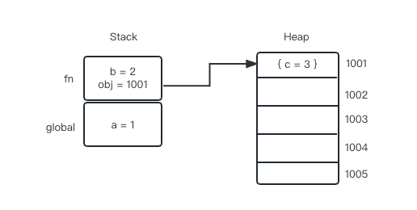

# 垃圾回收

`c/c++`等系统级语言，需要开发者手动维护内存（`rust`例外），这非常容易出错。而一些高级语言大多都有自动的垃圾回收机制，如 `java/go/javascript`。虽然他们有垃圾回收器，但作为开发者的我们还是要了解垃圾回收的工作方式和原理，这有助于帮助我们排查因**内存泄漏**而导致的卡顿，避免此类问题的发生。

> 这里只介绍浏览器（v8）的垃圾回收

要想弄明白垃圾回收，首先要理解变量的存储方式。

## 变量存储方式

`js` 变量分为**原始类型**（值类型）和**引用类型** ，不同类型的变量存储方式不同。其中原始类型存储在栈（`stack`）中，引用类型存储在堆（`heap`）中。示例代码在内存中的分布如下图所示：

```tsx
const a = 1;
const fn = () => {
	const b = 2;
	const obj = { name: 3 };
};
```



## 栈内存垃圾回收

`js` 执行过程中，会将当前上下文压入栈中，当该上下文执行完以后会进行出栈（其实就是指针下移到下面的上下文，当有新的上下文入栈时，会直接覆盖指针以上的空间）。当 `fn` 执行完以后，原始类型的变量 `b` 内存被直接释放了，引用类型 `obj` 的值还存储在 `Heap`上，销毁的只是对堆内存地址 1011 的引用。

## 堆内存垃圾回收

> 堆内存垃圾回收基于「代际假说」：大部分新对象的生存